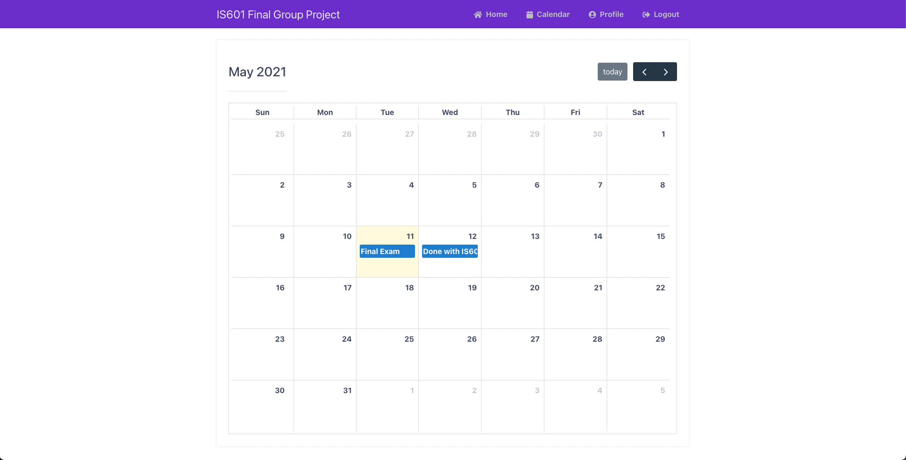

# Final Group Project
* By: Elio Nicolas & Anik Chattopadhyay 

Instructions: 
- Clone repo with command git clone 
- Use ```docker-compose up```
- Log in with 'test' as the username and password, navigate throughout site 
- Try to register yourself. 
- Thank you! 

# Screenshots
 ## Log In Page
 
 ## Logged In 
 
## User Profile
 
## Calendar
 
## Succesful Register
 
 ## SendGrid Email
 
 